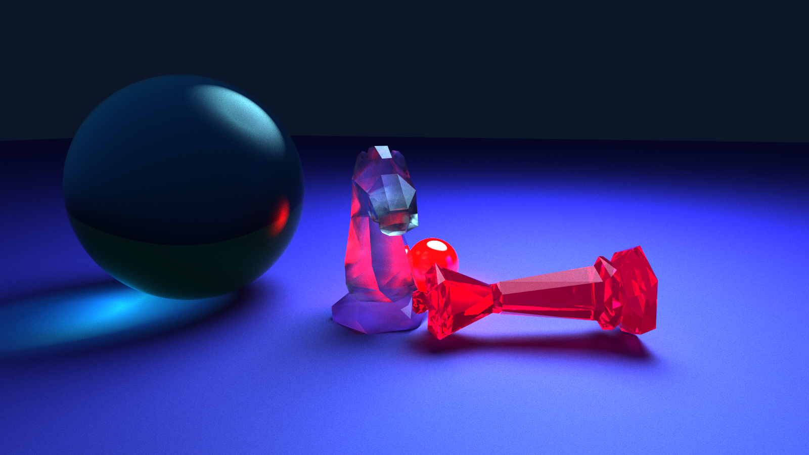
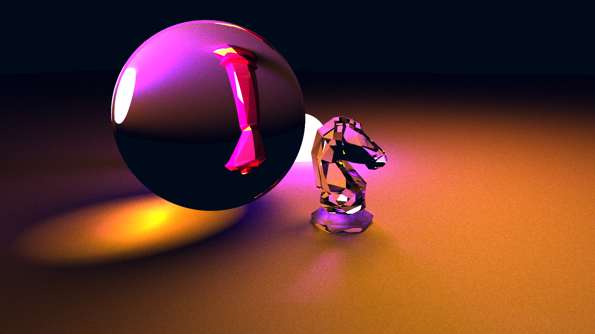
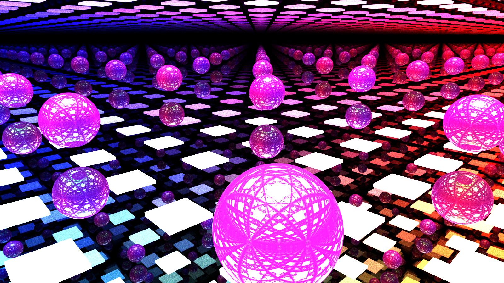
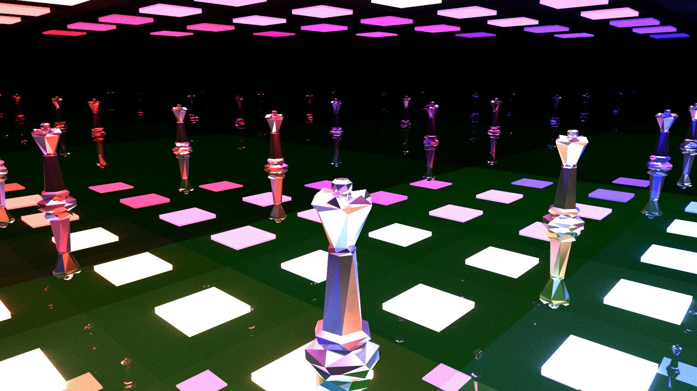
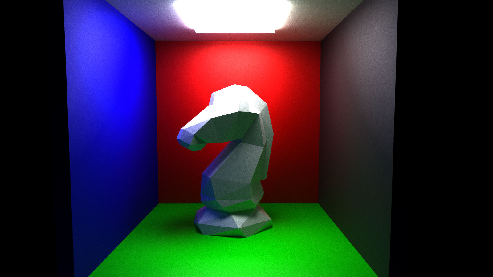
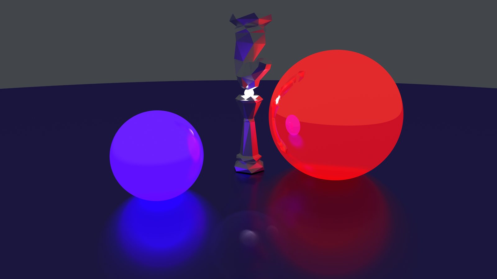
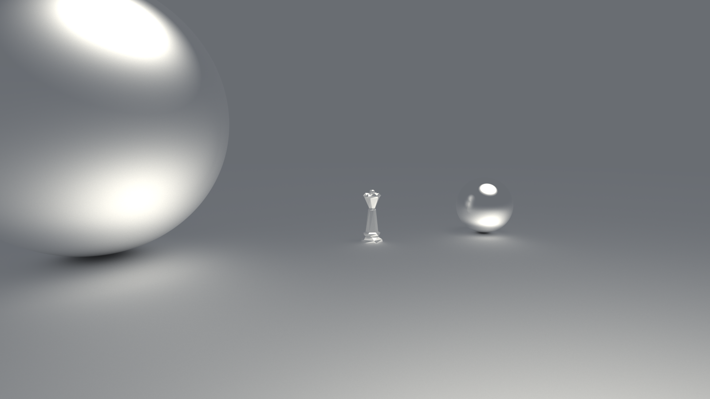
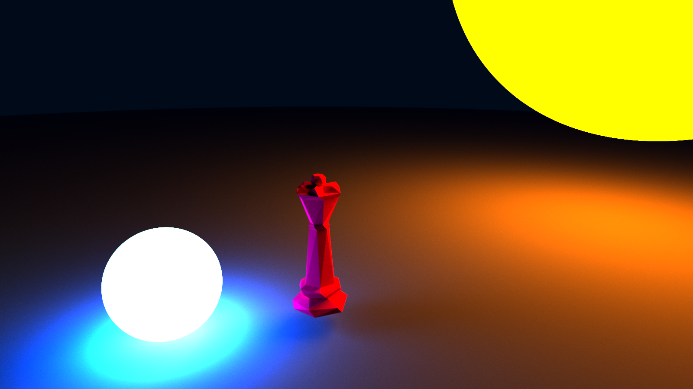

# Rust GPU raytracer

Currently a ongoing project building a raytracer running on the GPU with Vulkan!

The next goal is to add more meshes and hopefully add support for textures on the surfaces

