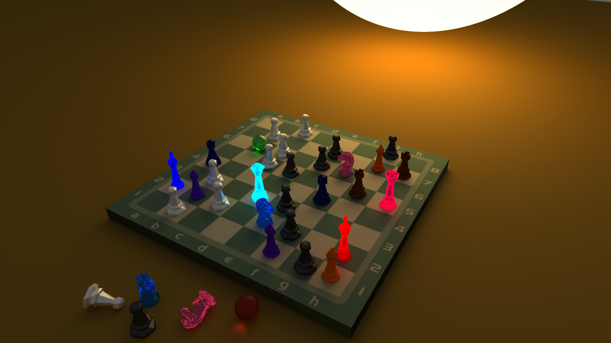
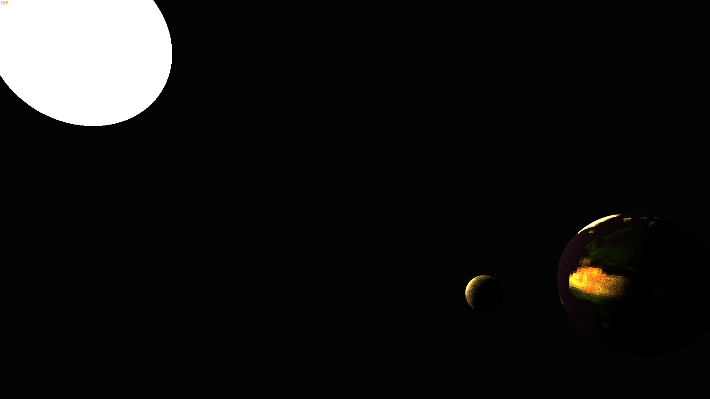

# Rust GPU raytracer

A realtime 3D GPU computed raytracer made in Rust and WGSL shader language.

Controls:
- hold right click to enter movement mode where you can:
  - move camera with your mouse
  - move in different direction with W A S D
  - move up and down with E and Q
- press F11 to hide and show the UI

<<<<<<< HEAD
All the objects in the world can be changed and manipulated from the UI

=======
>>>>>>> d99119bb8f8f160638db5d7966b42b34c4463987
Sources used for learning and inspiration:
- Lots and lots of documentation!
- [Ray Tracing in One Weekend](https://raytracing.github.io/)
- [The Cherno series in raytracing](https://www.youtube.com/watch?v=gfW1Fhd9u9Q&list=PLlrATfBNZ98edc5GshdBtREv5asFW3yXl)
- [Sebastian Lague's Coding Adventure: Ray Tracing](https://www.youtube.com/watch?v=Qz0KTGYJtUk)

